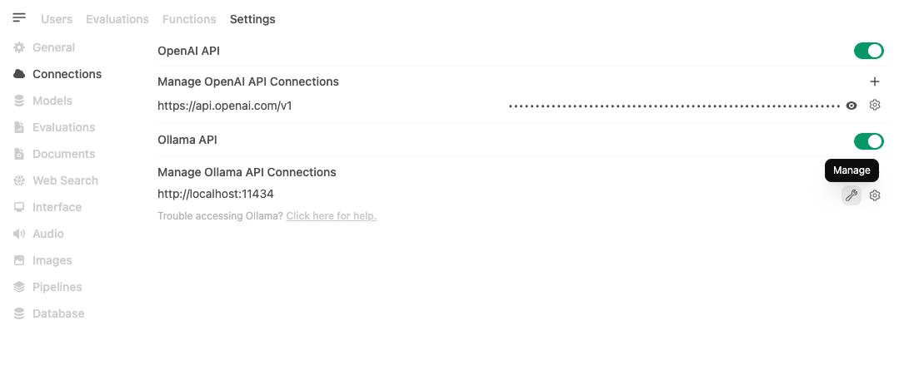
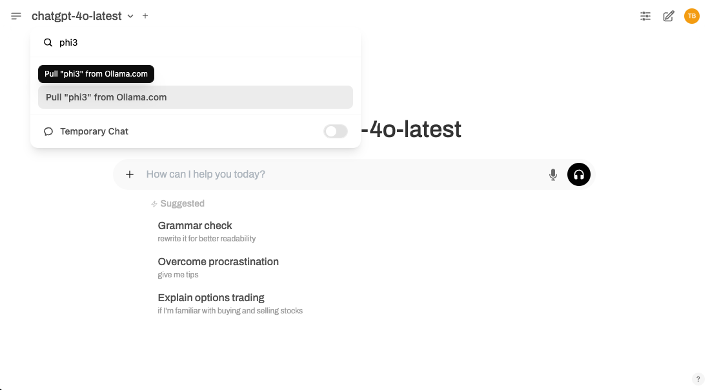

# Ollama + Open-WebUI 一键安装&避坑指南

## 作者简介

- 微信公众号：密码应用技术实战
- 博客园首页：https://www.cnblogs.com/informatics/
- GitHub地址：https://github.com/warm3snow


## 引言

随着大语言模型（LLM）技术的日益普及，越来越多的人希望能够在本地运行这些模型，以保证数据的隐私性和提高访问速度。本文将介绍如何使用 **Ollama** 和 **Open-WebUI** 两款工具，快速搭建一个本地运行的 AI 模型系统, 并提供一个简洁的 Web 界面，方便与 AI 模型进行交互。

注：Open-WebUI与AnythingLLM功能类似，但是Open-WebUI提供了更加丰富的

## 简介

- **Ollama** 是一款简单易用的本地模型运行工具，能够帮助用户通过命令行下载并运行大语言模型。
- **Open-WebUI** 提供了一个基于浏览器的前端界面，用户可以方便地与运行中的模型进行交互，实现问答、文本生成等功能。

## 安装步骤

### 部署方案1：使用Docker一键联合部署

1. **安装 Docker**：
   如果尚未安装 Docker，请前往 Docker 官网 下载并安装 Docker Desktop。
2. **启动 Ollama 和 Open-WebUI**：
    在终端中运行以下命令拉取 Ollama 和 Open-WebUI 镜像并启动服务：

```bash
# 拉取 Ollama 镜像并启动服务
    docker run -d -p 3000:8080 -v ollama:/root/.ollama -v open-webui:/app/backend/data --name open-webui --restart always ghcr.io/open-webui/open-webui:ollama

# 查看 Open-WebUI 服务是否正常启动
  ➜  ~ docker ps -a | grep webui
3cad17e4ac57   ghcr.io/open-webui/open-webui:ollama   "bash start.sh"           2 minutes ago   Up 2 minutes (healthy)      0.0.0.0:3000->8080/tcp, :::3000->8080/tcp   open-webui

➜  ~ docker logs 3cad17e4ac57
Loading WEBUI_SECRET_KEY from file, not provided as an environment variable.
Generating WEBUI_SECRET_KEY
Loading WEBUI_SECRET_KEY from .webui_secret_key
USE_OLLAMA is set to true, starting ollama serve.
2025/02/11 11:47:21 routes.go:1259: INFO server config env="map[CUDA_VISIBLE_DEVICES: GPU_DEVICE_ORDINAL: HIP_VISIBLE_DEVICES: HSA_OVERRIDE_GFX_VERSION: HTTPS_PROXY: HTTP_PROXY: NO_PROXY: OLLAMA_DEBUG:false OLLAMA_FLASH_ATTENTION:false OLLAMA_GPU_OVERHEAD:0 OLLAMA_HOST:http://127.0.0.1:11434 OLLAMA_INTEL_GPU:false OLLAMA_KEEP_ALIVE:5m0s OLLAMA_KV_CACHE_TYPE: OLLAMA_LLM_LIBRARY: OLLAMA_LOAD_TIMEOUT:5m0s OLLAMA_MAX_LOADED_MODELS:0 OLLAMA_MAX_QUEUE:512 OLLAMA_MODELS:/root/.ollama/models OLLAMA_MULTIUSER_CACHE:false OLLAMA_NOHISTORY:false OLLAMA_NOPRUNE:false OLLAMA_NUM_PARALLEL:0 OLLAMA_ORIGINS:[http://localhost https://localhost http://localhost:* https://localhost:* http://127.0.0.1 https://127.0.0.1 http://127.0.0.1:* https://127.0.0.1:* http://0.0.0.0 https://0.0.0.0 http://0.0.0.0:* https://0.0.0.0:* app://* file://* tauri://* vscode-webview://*] OLLAMA_SCHED_SPREAD:false ROCR_VISIBLE_DEVICES: http_proxy: https_proxy: no_proxy:]"
time=2025-02-11T11:47:21.996Z level=INFO source=images.go:757 msg="total blobs: 0"
time=2025-02-11T11:47:21.996Z level=INFO source=images.go:764 msg="total unused blobs removed: 0"
[GIN-debug] [WARNING] Creating an Engine instance with the Logger and Recovery middleware already attached.

[GIN-debug] [WARNING] Running in "debug" mode. Switch to "release" mode in production.
 - using env:	export GIN_MODE=release
 - using code:	gin.SetMode(gin.ReleaseMode)

[GIN-debug] POST   /api/pull                 --> github.com/ollama/ollama/server.(*Server).PullHandler-fm (5 handlers)
[GIN-debug] POST   /api/generate             --> github.com/ollama/ollama/server.(*Server).GenerateHandler-fm (5 handlers)
[GIN-debug] POST   /api/chat                 --> github.com/ollama/ollama/server.(*Server).ChatHandler-fm (5 handlers)
[GIN-debug] POST   /api/embed                --> github.com/ollama/ollama/server.(*Server).EmbedHandler-fm (5 handlers)
[GIN-debug] POST   /api/embeddings           --> github.com/ollama/ollama/server.(*Server).EmbeddingsHandler-fm (5 handlers)
[GIN-debug] POST   /api/create               --> github.com/ollama/ollama/server.(*Server).CreateHandler-fm (5 handlers)
[GIN-debug] POST   /api/push                 --> github.com/ollama/ollama/server.(*Server).PushHandler-fm (5 handlers)
[GIN-debug] POST   /api/copy                 --> github.com/ollama/ollama/server.(*Server).CopyHandler-fm (5 handlers)
[GIN-debug] DELETE /api/delete               --> github.com/ollama/ollama/server.(*Server).DeleteHandler-fm (5 handlers)
[GIN-debug] POST   /api/show                 --> github.com/ollama/ollama/server.(*Server).ShowHandler-fm (5 handlers)
[GIN-debug] POST   /api/blobs/:digest        --> github.com/ollama/ollama/server.(*Server).CreateBlobHandler-fm (5 handlers)
[GIN-debug] HEAD   /api/blobs/:digest        --> github.com/ollama/ollama/server.(*Server).HeadBlobHandler-fm (5 handlers)
[GIN-debug] GET    /api/ps                   --> github.com/ollama/ollama/server.(*Server).PsHandler-fm (5 handlers)
[GIN-debug] POST   /v1/chat/completions      --> github.com/ollama/ollama/server.(*Server).ChatHandler-fm (6 handlers)
[GIN-debug] POST   /v1/completions           --> github.com/ollama/ollama/server.(*Server).GenerateHandler-fm (6 handlers)
[GIN-debug] POST   /v1/embeddings            --> github.com/ollama/ollama/server.(*Server).EmbedHandler-fm (6 handlers)
[GIN-debug] GET    /v1/models                --> github.com/ollama/ollama/server.(*Server).ListHandler-fm (6 handlers)
[GIN-debug] GET    /v1/models/:model         --> github.com/ollama/ollama/server.(*Server).ShowHandler-fm (6 handlers)
[GIN-debug] GET    /                         --> github.com/ollama/ollama/server.(*Server).GenerateRoutes.func1 (5 handlers)
[GIN-debug] GET    /api/tags                 --> github.com/ollama/ollama/server.(*Server).ListHandler-fm (5 handlers)
[GIN-debug] GET    /api/version              --> github.com/ollama/ollama/server.(*Server).GenerateRoutes.func2 (5 handlers)
[GIN-debug] HEAD   /                         --> github.com/ollama/ollama/server.(*Server).GenerateRoutes.func1 (5 handlers)
[GIN-debug] HEAD   /api/tags                 --> github.com/ollama/ollama/server.(*Server).ListHandler-fm (5 handlers)
[GIN-debug] HEAD   /api/version              --> github.com/ollama/ollama/server.(*Server).GenerateRoutes.func2 (5 handlers)
time=2025-02-11T11:47:21.996Z level=INFO source=routes.go:1310 msg="Listening on 127.0.0.1:11434 (version 0.5.4)"
time=2025-02-11T11:47:21.997Z level=INFO source=routes.go:1339 msg="Dynamic LLM libraries" runners="[cpu cuda_v11 cuda_v12]"
time=2025-02-11T11:47:21.998Z level=INFO source=gpu.go:226 msg="looking for compatible GPUs"
time=2025-02-11T11:47:22.004Z level=INFO source=gpu.go:392 msg="no compatible GPUs were discovered"
time=2025-02-11T11:47:22.004Z level=INFO source=types.go:131 msg="inference compute" id=0 library=cpu variant="no vector extensions" compute="" driver=0.0 name="" total="15.6 GiB" available="14.7 GiB"
/app/backend/open_webui
/app/backend
/app
Running migrations
INFO  [alembic.runtime.migration] Context impl SQLiteImpl.
INFO  [alembic.runtime.migration] Will assume non-transactional DDL.
INFO  [open_webui.env] 'ENABLE_OLLAMA_API' loaded from the latest database entry
INFO  [open_webui.env] 'OLLAMA_BASE_URLS' loaded from the latest database entry
INFO  [open_webui.env] 'OLLAMA_API_CONFIGS' loaded from the latest database entry
INFO  [open_webui.env] 'ENABLE_OPENAI_API' loaded from the latest database entry
INFO  [open_webui.env] 'OPENAI_API_KEYS' loaded from the latest database entry
INFO  [open_webui.env] 'OPENAI_API_BASE_URLS' loaded from the latest database entry
INFO  [open_webui.env] 'OPENAI_API_CONFIGS' loaded from the latest database entry
INFO  [open_webui.env] 'ENABLE_SIGNUP' loaded from the latest database entry
INFO  [open_webui.env] 'DEFAULT_LOCALE' loaded from the latest database entry
INFO  [open_webui.env] 'DEFAULT_PROMPT_SUGGESTIONS' loaded from the latest database entry
WARNI [open_webui.env]

WARNING: CORS_ALLOW_ORIGIN IS SET TO '*' - NOT RECOMMENDED FOR PRODUCTION DEPLOYMENTS.

INFO  [open_webui.env] Embedding model set: sentence-transformers/all-MiniLM-L6-v2
WARNI [langchain_community.utils.user_agent] USER_AGENT environment variable not set, consider setting it to identify your requests.
INFO:     Started server process [1]
INFO:     Waiting for application startup.
INFO:     Application startup complete.
INFO:     Uvicorn running on http://0.0.0.0:8080 (Press CTRL+C to quit)
```

从日志中可以看到 Open-WebUI 服务已经正常启动，且容器内的 Ollama 服务也已启动。通过浏览器访问 http://localhost:3000，即可进入 Open-WebUI 的界面。

### 部署方案2：使用Docker部署Open-WebUI，并连接外部Ollama

1. **使用Docker部署Open-WebUI**：

在终端中运行以下命令拉取 Open-WebUI镜像并启动服务：

```bash
# 下载 Open-WebUI 代码
➜  ~ git clone https://github.com/open-webui/open-webui.git
➜  ~ cd open-webui

#  --add-host=host.docker.internal:host-gateway 用于解决 Docker 容器内无法访问宿主机的问题
#  -p 3000:8080 将 Open-WebUI 服务绑定到本地的 3000 端口 
#  -v open-webui:/app/backend/data 将 Open-WebUI 的数据目录映射到 Docker 卷 open-webui
➜  ~ docker run -d -p 3000:8080 --add-host=host.docker.internal:host-gateway -v open-webui:/app/backend/data --name open-webui --restart always ghcr.io/open-webui/open-webui:main

# 查看 Open-WebUI 服务是否正常启动
➜  ~ docker ps -a | grep webui
17a4d2517590   ghcr.io/open-webui/open-webui:main   "bash start.sh"           58 seconds ago   Up 57 seconds (health: starting)   0.0.0.0:3000->8080/tcp, :::3000->8080/tcp   open-webui
➜  ~ docker logs -f 17a4d2517590
Loading WEBUI_SECRET_KEY from file, not provided as an environment variable.
Generating WEBUI_SECRET_KEY
Loading WEBUI_SECRET_KEY from .webui_secret_key
/app/backend/open_webui
/app/backend
/app
Running migrations
INFO  [alembic.runtime.migration] Context impl SQLiteImpl.
INFO  [alembic.runtime.migration] Will assume non-transactional DDL.
INFO  [open_webui.env] 'ENABLE_OLLAMA_API' loaded from the latest database entry
INFO  [open_webui.env] 'OLLAMA_BASE_URLS' loaded from the latest database entry
INFO  [open_webui.env] 'OLLAMA_API_CONFIGS' loaded from the latest database entry
INFO  [open_webui.env] 'ENABLE_OPENAI_API' loaded from the latest database entry
INFO  [open_webui.env] 'OPENAI_API_KEYS' loaded from the latest database entry
INFO  [open_webui.env] 'OPENAI_API_BASE_URLS' loaded from the latest database entry
INFO  [open_webui.env] 'OPENAI_API_CONFIGS' loaded from the latest database entry
INFO  [open_webui.env] 'ENABLE_SIGNUP' loaded from the latest database entry
INFO  [open_webui.env] 'DEFAULT_LOCALE' loaded from the latest database entry
INFO  [open_webui.env] 'DEFAULT_PROMPT_SUGGESTIONS' loaded from the latest database entry
WARNI [open_webui.env]

WARNING: CORS_ALLOW_ORIGIN IS SET TO '*' - NOT RECOMMENDED FOR PRODUCTION DEPLOYMENTS.

INFO  [open_webui.env] Embedding model set: sentence-transformers/all-MiniLM-L6-v2
WARNI [langchain_community.utils.user_agent] USER_AGENT environment variable not set, consider setting it to identify your requests.
INFO:     Started server process [1]
INFO:     Waiting for application startup.
INFO:     Application startup complete.
INFO:     Uvicorn running on http://0.0.0.0:8080 (Press CTRL+C to quit)
```

从日志中可以看到 Open-WebUI 服务已经正常启动.


2. **配置 Open-WebUI 与 Ollama 连接**

    - 进入 Open WebUI 中的 管理员设置。
    - 导航至 连接 > Ollama > 管理（点击扳手图标）。
    - 在这里，您可以下载模型、配置设置，并管理与 Ollama 的连接。

以下是管理界面的截图：



注：

- 由于我们使用本地模型，因此无需关注OpenAI API
- 对于Ollama API Connections，一定要将localhost:11434修改为：<实际IP地址>:11434


## 测试模型：
在 Open-WebUI 主页或Workspace中，选择合适的模型后，在对话框输入问题，测试模型是否能正确响应。你可以尝试问一些关于模型的知识，查看其回答是否准确。
- 如果Ollama已下载模型，下列列表会显示
- 如果Ollama未下载模型，会自动下载模型




## 4. 常见问题与解决方法
问题 1: Ollama 下载模型失败
	- 解决方法：检查你的网络连接是否稳定。你可以尝试更换网络环境或重启下载。如果问题持续存在，尝试清空 Ollama 的缓存并重新启动。

问题 2: WebUI 显示 500 错误
	- 解决方法：查看 Open-WebUI 的日志，确认是否有报错信息。如果日志中有关于依赖库缺失或配置错误的提示，按照提示进行修复。

问题 3: WebUI 无法连接到外部 Ollama
	解决方法：确认 Ollama 和 Open-WebUI网路互通，且 Ollama 服务已正常启动。如果没有，重新启动 Ollama 或检查网络设置。特别需要提到的是：
        - 如果本地host方式启动的Ollama 服务，需要设置： OLLAMA_ORIGINS="*" OLLAMA_HOST=0.0.0.0:11434
        - WebUI管理员页面配置Ollama时，Ollama的地址需要填写实际地址：http://<实际IP地址>:11434

问题 4: Open-WebUI启动后，页面打开显示空白
    - 解决方法：Open-WebUI启动比较缓慢，需要等待一段时间, 直到docker日志中显示服务已经启动完成。

## 5. 总结

通过本文的教程，你已经学会了如何使用 Ollama 和 Open-WebUI 搭建一个本地运行的 AI 模型系统。借助 Docker 部署 Open-WebUI，使得安装和管理过程更加简便。无论是用于学习、开发还是私有知识库的搭建，本地运行 AI 模型的方案都可以为你提供更高的数据隐私性和响应速度。本文未对Open-WebUI的功能进行详细介绍，但是Open-WebUI提供了更加丰富的功能，包括多模型支持等。如果你对Open-WebUI感兴趣，可以查看官方文档了解更多信息。

希望这篇教程能帮助你顺利搭建 AI 模型系统，并享受本地部署带来的高效和安全。如果遇到问题，可以参考常见问题与解决方法章节中的提示进行排查。
