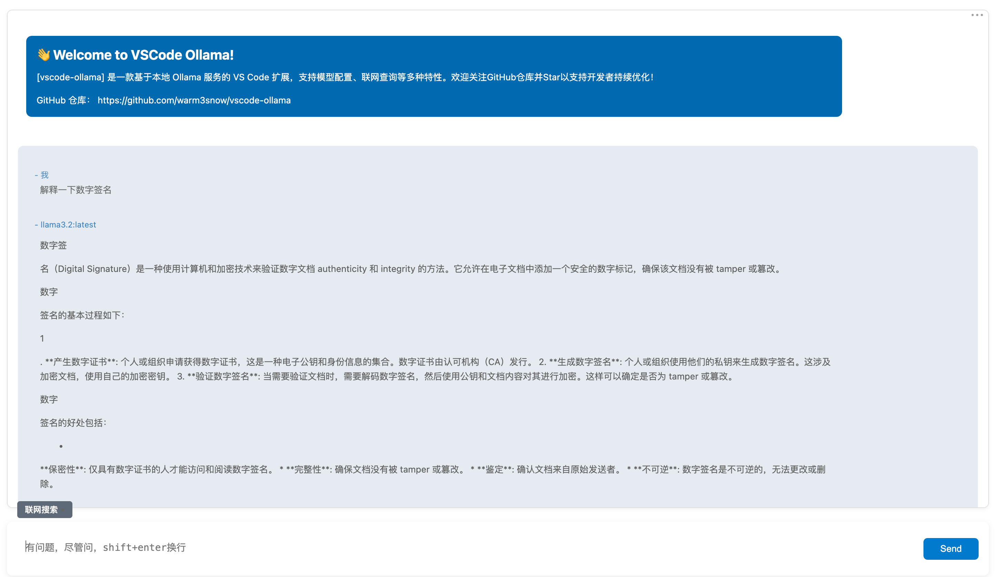

# 在 VSCode 中使用 Ollama 插件进行智能 Chat：安装、配置与体验

## 作者简介

- 微信公众号：密码应用技术实战
- 博客园首页：[https://www.cnblogs.com/informatics/](https://github.com/warm3snow)
- GitHub地址：[https://github.com/warm3snow](https://github.com/warm3snow)

## 目录

1. [背景介绍](#背景介绍)
2. [安装部署](#安装部署)
   - [VSCode 安装](#vscode-安装)
   - [Ollama 安装与模型下载](#ollama-安装与模型下载)
   - [VSCode-Ollama 插件安装](#vscode-ollama-插件安装)
3. [体验](#体验)
   - [Settings 设置](#settings-设置)
   - [测试连接 (Test Connection)](#测试连接-test-connection)
   - [打开 Chat 以及 Chat 的主要功能介绍](#打开-chat-以及-chat-的主要功能介绍)

---

## 背景介绍

随着 AI 技术的迅速发展，越来越多的开发工具开始集成智能助手，帮助开发者提升工作效率。VSCode 是全球开发者常用的编辑器，而 Ollama 插件则提供了一种高效的方式，直接在 VSCode 中使用多种 GPT 模型进行交互式 Chat。

通过 Ollama 插件，开发者可以根据需要选择不同的模型（如 GPT-3、GPT-4 等）来与 AI 进行对话。这种选择多样的方式，不仅增强了开发者与 AI 的互动性，还能根据不同的任务需求选择最合适的模型进行 Chat。

本文将详细介绍如何安装和使用 VSCode-Ollama 插件，并带你体验其强大的 Chat 功能。

---

## 安装部署

### VSCode 安装

首先，确保你的机器上安装了 Visual Studio Code。你可以从 [VSCode 官方网站](https://code.visualstudio.com/) 下载并安装。

安装过程简单，按照向导进行即可。完成后，打开 VSCode，准备安装 Ollama 插件。

### Ollama 安装与模型下载

Ollama 是一个支持多种 GPT 模型的平台，允许你在本地运行 AI 模型。

1. 首先，你需要在本地安装 Ollama 客户端。你可以通过以下命令在终端中安装：

```bash
curl -sSL https://ollama.com/install | bash
```

2. 安装完成后，你可以通过 ollama models 命令查看可用的模型，并选择你想要下载的模型。例如，下载 GPT-3 模型：

```bash
ollama pull deepseek-r1:1.5b
```

3. 下载完成后，Ollama 客户端会在本地运行，并准备好与 VSCode 插件连接。

### VSCode-Ollama 插件安装

1. 打开 VSCode，进入扩展商店。
2. 搜索 “Ollama” 插件，并点击 “安装”。
3. 安装完成后，插件图标会出现在左侧活动栏中，点击即可打开 Ollama 插件。

安装完成后，你就可以在 VSCode 中与 AI 模型进行交互了。

## 体验

### Settings 设置

在开始使用 Chat 功能之前，你需要进行一些基本的设置，确保插件能够正确连接到 Ollama 客户端，并根据你的需求配置模型。
	1.	打开 VSCode 设置 (Command + Shift + P)。
	2.	在设置搜索框中输入 “Ollama: Settings”，找到相关的插件设置项。
	3.	配置 Base URL 字段，指向你的 Ollama地址。默认为 http://127.0.0.1:11434。
	4.  配置 Model 字段，选择你想要使用的 AI 模型。例如，你可以选择 deepseek-r1:1.5b 等模型，并设定其它连接参数。

完成设置后，你就可以通过插件轻松与不同的 AI 模型进行交互了。

### 测试连接 (Test Connection)

配置好插件后，可以通过”Test Connection” 按钮测试连接是否正常。
	1.	在 VSCode 设置（Command + Shift + P）中搜索 “Ollama: Test Connection”。
	2.	点击 “Test Connection” ，插件会尝试连接配置的 Ollama 客户端。

如果连接成功，右下角会显示确认测试连接成功信息。如果连接失败，请检查 Ollama 客户端是否已经启动，或者插件的配置是否正确。

### 打开 Chat

Ollama 插件的核心功能是与不同的 AI 模型进行对话。在 VSCode 中，你可以通过选择不同的模型来与 AI 进行交互，这使得插件具有极高的灵活性。不同模型的配置见上文的 **Settings 设置**。
	1.	在 VSCode 设置（Command + Shift + P）中搜索 “Ollama: Open Chat”，进入 Chat 页面。
	2.	在Chat界面我们可以看到欢迎界面
	3.	根据设置的模型，你可以开始与 AI 进行对话。输入问题或命令，AI 会根据模型的能力进行回答。

对话界面如下：


通过这些功能，Ollama 插件不仅能提升效率，还能作为一个智能助手，帮你快速解决各种问题。

## 总结

VSCode 与 Ollama 插件的结合，为创作者提供了强大的 AI Chat 功能。通过选择不同的 GPT 模型，你可以在开发过程中获得实时的帮助，提升效率。无论是代码补全、错误诊断，还是文档生成，Ollama 插件都能为你带来显著的帮助。如果你还没有尝试过，赶快按照本文的步骤进行安装并体验吧！
